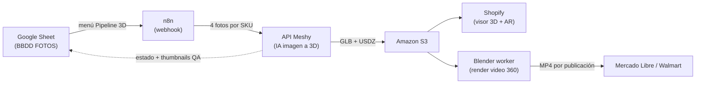

# Pipeline 3D Argenparts — Visualización interactiva de productos

Proyecto para generar **modelos 3D interactivos y videos 360°** de todo el catálogo de autopartes, de forma automática, a partir de las fotografías existentes.

**Estado: pipeline validado de extremo a extremo (21/07/2026).** Un SKU pasa de la base de datos al modelo 3D terminado en ~3 minutos, sin intervención humana.

---

## 🔩 Demo con pieza real

**[▶ Ver el modelo 3D interactivo (P2100724 — pierna de suspensión AG Proshock)](modelo/P2100724.glb)** ← GitHub lo abre en un visor 3D: gíralo con el mouse.

*Generado por IA a partir de solo 4 fotografías de catálogo. La animación es una captura de validación a 14 cuadros; el video de producción se renderiza a 24-30 fps.*

---

## Cómo funciona

1. La hoja **Cola 3D** del Sheet detecta los SKUs elegibles (4+ fotos) y los manda por lotes a n8n.
2. n8n crea la tarea en el **API de Meshy** con las 4 mejores fotos del SKU (a resolución original desde S3).
3. Al terminar (~3 min), el modelo **GLB/USDZ** se guarda en S3 y la fila del Sheet se actualiza sola con las URLs y 4 miniaturas para control de calidad.
4. Un humano aprueba o rechaza (compuerta de QA obligatoria — la IA infiere las caras no fotografiadas).
5. Del mismo modelo salen: **visor interactivo en Shopify** (con AR), modelo para Amazon (si la categoría es elegible) y **videos 360 renderizados** para Mercado Libre/Walmart — una variante por publicación, sin costo extra de generación.

## Resultados de las pruebas

| # | Fecha | Prueba | Resultado |
|---|-------|--------|-----------|
| 1 | 15/07 | Meshy web, 1 foto degradada (711px) | Modelo coherente en giro 360; textura consistente |
| 2 | 15/07 | Tripo web, misma foto | Geometría buena (1.9M caras); textura más plana |
| 3 | 21/07 | **Pipeline completo por API** (4 fotos originales) | ✅ Sheet → n8n → Meshy → Sheet en **3 min 7 s**, cero intervención |
| 4 | 21/07 | Video 360 desde el GLB | ✅ Giro completo sin geometría rota (ver GIF arriba) |

## ¿Cuánto cuesta digitalizar TODO el catálogo?

**2,749 SKUs elegibles × 30 créditos de Meshy = 82,470 créditos.** El video NO consume créditos: se renderiza en equipo propio con Blender (gratis, solo CPU).

| Concepto | Cantidad | Costo estimado (MXN) |
|---|---|---|
| Modelos 3D (30 créditos/SKU, tarifa oficial) | 82,470 créditos | ≈ **$28,800** (referencia a tarifa Pro; negociable por volumen) |
| Suscripción base Meshy Pro | 12 meses | $4,188/año |
| Render de videos (worker Blender propio) | 2,749 videos | ≈ $0 en créditos; $150–300/mes de servidor |
| Almacenamiento S3 (~50 GB) | mensual | $25–50/mes |

### ¿Todo de golpe o mes por mes?

- **Todo de golpe (~$29,000 MXN hoy):** técnicamente posible, pero genera 2,749 modelos pendientes de revisión visual de un jalón — el QA humano es el cuello de botella real — y compromete todo el presupuesto **antes** de validar el impacto en ventas.
- **Mes a mes solo con la suscripción Pro (1,000 créditos ≈ 33 SKUs/mes):** tomaría **+7 años**. Inviable.
- **✅ Recomendado — lotes Pareto:** suscripción Pro + compra de créditos por lote de ~500 SKUs/mes (**≈ $5,200 MXN/mes**), empezando por los códigos de mayor venta. Catálogo completo en **~6 meses**, cada lote se autoriza con la evidencia de conversión del anterior, y el QA avanza al ritmo de la generación. Si la conversión valida fuerte en los primeros lotes, se negocia volumen con Meshy y se acelera.

## Contenido del repositorio

| Archivo | Qué es |
|---|---|
| [`docs/Plan_Fases_Visualizacion_3D_Argenparts.docx`](docs/Plan_Fases_Visualizacion_3D_Argenparts.docx) | Plan completo por fases (APQP): diagnóstico, plataformas, costos, riesgos, evidencia fotográfica |
| [`modelo/P2100724.glb`](modelo/P2100724.glb) | Modelo 3D de la pieza demo (comprimido 13.3→10 MB, listo para Shopify) |
| [`media/P2100724_360_prueba.gif`](media/P2100724_360_prueba.gif) | Animación 360 de validación |
| [`scripts/Codigo_AppsScript_Cola3D.gs`](scripts/Codigo_AppsScript_Cola3D.gs) | Apps Script del Google Sheet: cola, prioridades, envío por lotes, callback |
| [`scripts/n8n_Pipeline_Meshy.json`](scripts/n8n_Pipeline_Meshy.json) | Workflow de n8n importable (credenciales como placeholders) |
| [`scripts/render_turntable.py`](scripts/render_turntable.py) | Script de Blender headless para el render del video 360 |

> ⚠️ Los scripts están **saneados**: API keys, tokens y URLs internas fueron reemplazados por placeholders. Las credenciales reales viven solo en n8n.

## Pendientes

- [ ] Credencial AWS en n8n (los GLB hoy usan URLs temporales de Meshy)
- [ ] Servidor/PC para el worker de Blender (videos)
- [ ] Especificaciones de edición de video por tipo de publicación MeLi
- [ ] Lista de prioridades de SKUs (hoja `Prioridades` del Sheet)
- [ ] Verificar elegibilidad 3D de la categoría en Amazon MX Seller Central
- [ ] Rotar la API key usada en fase de prueba

---
*Proyecto interno de Argenparts · Julio 2026*
